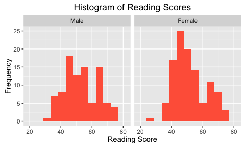
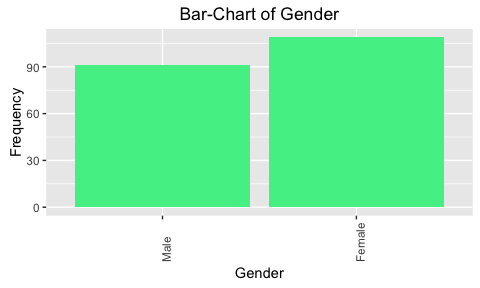
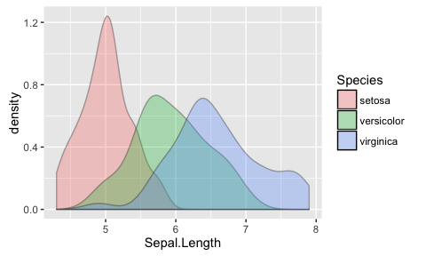
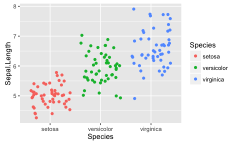

# Introduction to R
MPA 6020 (Spring 2016)  
December 22, 2015  


# Graphics in R
Now we'll see one of R's premier packages in action when graphing data. Let us load the __hsb2.RData__ we saved earlier. 


```r
load("~/Downloads/Archive/hsb2.RData")
```

<code>ggplot2</code> is one of the leading R packages for graphics, followed closely by <code>lattice</code>. Let us work with _ggplot2_ first and fit some simple graphs. Note that there is extensive help available for <code>ggplot2</code> on the web. You can start with the [Cookbook for R](http://www.cookbook-r.com/Graphs/index.html) or the [ggplot2 documentation](http://docs.ggplot2.org/current/). You can also search on [stackoverflow](http://stackoverflow.com/questions/tagged/ggplot2). 

## The Mechanics of ggplot2
<code>ggplot2</code> uses the grammar of graphics to build graphs by breaking up each graph into three components -- data, aesthetics, and geometry. You specify the data frame with the <code>data</code> command, then the x and y coordinates with the <code>aes</code> command, and finally the geometry (bar-chart, histogram, etc.) via the <code>geom_</code> command. The geometry for some of the graphs we will use most often is listed below:

* geom_bar() -- bar-chart
* geom_histogram() -- histogram
* geom_line() -- line chart
* geom_point() -- scatte plot
* geom_density() -- density plots
* geom_jitter() -- stripcharts


# Constructing Graphs
Recall that for numeric variables we can rely on __box-plots__ and __histograms__  to explore the distribution of a numeric (scale) variable. Perhaps we are interested in  _reading_ scores and want to start with a histogram. 

## Histograms

```r
library(ggplot2)
ggplot(data = hsb2, aes(x = read)) + geom_histogram()
```


You see R telling you that <code>`stat_bin()` using `bins = 30`. Pick better value with `binwidth`.</code>. That is, R is automatically grouping _read_ in a way that there are 30 groups. Maybe we want fewer groups, maybe 10. This can be done as follows:


```r
ggplot(data = hsb2, aes(x = read)) + geom_histogram(bins = 10)
```


We can customize this histogram further, changing the colors, the labels for the x-axis, the y-axis, adding a title, and so on. 


```r
ggplot(data = hsb2, aes(x = read)) + geom_histogram(bins = 10, 
    fill = "cornflowerblue") + ggtitle("Histogram of Reading Scores") + 
    xlab("Reading Score") + ylab("Frequency")
```


```r
ggplot(data = hsb2, aes(x = read)) + geom_histogram(bins = 10, 
    fill = "salmon") + ggtitle("Histogram of Reading Scores") + 
    xlab("Reading Score") + ylab("Frequency")
```


```r
ggplot(data = hsb2, aes(x = read)) + geom_histogram(bins = 10, 
    fill = "deeppink1") + ggtitle("Histogram of Reading Scores") + 
    xlab("Reading Score") + ylab("Frequency")
```


```r
ggplot(data = hsb2, aes(x = read)) + geom_histogram(bins = 10, 
    fill = "yellowgreen") + ggtitle("Histogram of Reading Scores") + 
    xlab("Reading Score") + ylab("Frequency")
```


Note: A small snippet of the wide expanse of colors available in R can be seen [here](http://www.stat.columbia.edu/~tzheng/files/Rcolor.pdf) and you can always brew your own color palette (ask me and I'll give you the code).


What if wanted to construct these histograms for male versus female students, or for each of the SES groups?


```r
ggplot(data = hsb2, aes(x = read)) + geom_histogram(bins = 10, 
    fill = "tomato") + ggtitle("Histogram of Reading Scores") + 
    xlab("Reading Score") + ylab("Frequency") + facet_wrap(~female)
```



```r
ggplot(data = hsb2, aes(x = read)) + geom_histogram(bins = 10, 
    fill = "tomato") + ggtitle("Histogram of Reading Scores") + 
    xlab("Reading Score") + ylab("Frequency") + facet_wrap(~ses)
```


What if we wanted to break it out by female/male students in public versus private schools?


```r
ggplot(data = hsb2, aes(x = read)) + geom_histogram(bins = 10, 
    fill = "tomato") + ggtitle("Histogram of Reading Scores") + 
    xlab("Reading Score") + ylab("Frequency") + facet_wrap(female ~ 
    schtyp)
```


## Box-plots
Now we can revisit the preceding distributions, albeit with box-plots
.


```r
ggplot(data = hsb2, aes(x = female, y = read)) + geom_boxplot(fill = "seagreen2") + 
    ggtitle("Box-Plot of Reading Scores") + xlab("Gender") + 
    ylab("Reading Score") + coord_flip()
```


```r
ggplot(data = hsb2, aes(x = female, y = read)) + geom_boxplot(fill = "peachpuff") + 
    ggtitle("Box-Plot of Reading Scores (by Gender & School Type)") + 
    xlab("Gender") + ylab("Reading Score") + coord_flip() + facet_wrap(~schtyp)
```


## Bar-Charts
Recall the bar-charts we used for qualitative variables last semester. Let us generate a few for gender, schtyp, prog, ses, and race. 


```r
ggplot(data = hsb2, aes(female)) + geom_bar(fill = "seagreen2") + 
    ggtitle("Bar-Chart of Gender") + xlab("Gender") + ylab("Frequency") + 
    theme(axis.text.x = element_text(angle = 90, hjust = 0))
```



```r
ggplot(data = hsb2, aes(race)) + geom_bar(fill = "seagreen2") + 
    ggtitle("Bar-Chart of Race (by School Type)") + xlab("Race") + 
    ylab("Frequency") + facet_wrap(~schtyp) + theme(axis.text.x = element_text(angle = 90, 
    hjust = 0))
```


```r
ggplot(data = hsb2, aes(race)) + geom_bar(fill = "seagreen2") + 
    ggtitle("Bar-Chart of Race (by SES & School Type)") + xlab("Race") + 
    ylab("Frequency") + facet_wrap(ses ~ schtyp) + theme(axis.text.x = element_text(angle = 90, 
    hjust = 0))
```


```r
ggplot(data = hsb2, aes(race)) + geom_bar(fill = "seagreen2") + 
    ggtitle("Bar-Chart of Race (by SES & School Type)") + xlab("Race") + 
    ylab("Frequency") + facet_wrap(ses ~ schtyp, ncol = 2) + 
    theme(axis.text.x = element_text(angle = 90, hjust = 0))
```


## Line Charts
If you have data over time then line charts are a good way to show trends over time. 


```r
library(plotly)
plot_ly(economics, x = date, y = uempmed, name = "unemployment")
```

<!--html_preserve--><div id="htmlwidget-1650" style="width:480px;height:288px;" class="plotly"></div>
<script type="application/json" data-for="htmlwidget-1650">{"x":{"data":[{"type":"scatter","inherit":true,"x":["1967-07-01","1967-08-01","1967-09-01","1967-10-01","1967-11-01","1967-12-01","1968-01-01","1968-02-01","1968-03-01","1968-04-01","1968-05-01","1968-06-01","1968-07-01","1968-08-01","1968-09-01","1968-10-01","1968-11-01","1968-12-01","1969-01-01","1969-02-01","1969-03-01","1969-04-01","1969-05-01","1969-06-01","1969-07-01","1969-08-01","1969-09-01","1969-10-01","1969-11-01","1969-12-01","1970-01-01","1970-02-01","1970-03-01","1970-04-01","1970-05-01","1970-06-01","1970-07-01","1970-08-01","1970-09-01","1970-10-01","1970-11-01","1970-12-01","1971-01-01","1971-02-01","1971-03-01","1971-04-01","1971-05-01","1971-06-01","1971-07-01","1971-08-01","1971-09-01","1971-10-01","1971-11-01","1971-12-01","1972-01-01","1972-02-01","1972-03-01","1972-04-01","1972-05-01","1972-06-01","1972-07-01","1972-08-01","1972-09-01","1972-10-01","1972-11-01","1972-12-01","1973-01-01","1973-02-01","1973-03-01","1973-04-01","1973-05-01","1973-06-01","1973-07-01","1973-08-01","1973-09-01","1973-10-01","1973-11-01","1973-12-01","1974-01-01","1974-02-01","1974-03-01","1974-04-01","1974-05-01","1974-06-01","1974-07-01","1974-08-01","1974-09-01","1974-10-01","1974-11-01","1974-12-01","1975-01-01","1975-02-01","1975-03-01","1975-04-01","1975-05-01","1975-06-01","1975-07-01","1975-08-01","1975-09-01","1975-10-01","1975-11-01","1975-12-01","1976-01-01","1976-02-01","1976-03-01","1976-04-01","1976-05-01","1976-06-01","1976-07-01","1976-08-01","1976-09-01","1976-10-01","1976-11-01","1976-12-01","1977-01-01","1977-02-01","1977-03-01","1977-04-01","1977-05-01","1977-06-01","1977-07-01","1977-08-01","1977-09-01","1977-10-01","1977-11-01","1977-12-01","1978-01-01","1978-02-01","1978-03-01","1978-04-01","1978-05-01","1978-06-01","1978-07-01","1978-08-01","1978-09-01","1978-10-01","1978-11-01","1978-12-01","1979-01-01","1979-02-01","1979-03-01","1979-04-01","1979-05-01","1979-06-01","1979-07-01","1979-08-01","1979-09-01","1979-10-01","1979-11-01","1979-12-01","1980-01-01","1980-02-01","1980-03-01","1980-04-01","1980-05-01","1980-06-01","1980-07-01","1980-08-01","1980-09-01","1980-10-01","1980-11-01","1980-12-01","1981-01-01","1981-02-01","1981-03-01","1981-04-01","1981-05-01","1981-06-01","1981-07-01","1981-08-01","1981-09-01","1981-10-01","1981-11-01","1981-12-01","1982-01-01","1982-02-01","1982-03-01","1982-04-01","1982-05-01","1982-06-01","1982-07-01","1982-08-01","1982-09-01","1982-10-01","1982-11-01","1982-12-01","1983-01-01","1983-02-01","1983-03-01","1983-04-01","1983-05-01","1983-06-01","1983-07-01","1983-08-01","1983-09-01","1983-10-01","1983-11-01","1983-12-01","1984-01-01","1984-02-01","1984-03-01","1984-04-01","1984-05-01","1984-06-01","1984-07-01","1984-08-01","1984-09-01","1984-10-01","1984-11-01","1984-12-01","1985-01-01","1985-02-01","1985-03-01","1985-04-01","1985-05-01","1985-06-01","1985-07-01","1985-08-01","1985-09-01","1985-10-01","1985-11-01","1985-12-01","1986-01-01","1986-02-01","1986-03-01","1986-04-01","1986-05-01","1986-06-01","1986-07-01","1986-08-01","1986-09-01","1986-10-01","1986-11-01","1986-12-01","1987-01-01","1987-02-01","1987-03-01","1987-04-01","1987-05-01","1987-06-01","1987-07-01","1987-08-01","1987-09-01","1987-10-01","1987-11-01","1987-12-01","1988-01-01","1988-02-01","1988-03-01","1988-04-01","1988-05-01","1988-06-01","1988-07-01","1988-08-01","1988-09-01","1988-10-01","1988-11-01","1988-12-01","1989-01-01","1989-02-01","1989-03-01","1989-04-01","1989-05-01","1989-06-01","1989-07-01","1989-08-01","1989-09-01","1989-10-01","1989-11-01","1989-12-01","1990-01-01","1990-02-01","1990-03-01","1990-04-01","1990-05-01","1990-06-01","1990-07-01","1990-08-01","1990-09-01","1990-10-01","1990-11-01","1990-12-01","1991-01-01","1991-02-01","1991-03-01","1991-04-01","1991-05-01","1991-06-01","1991-07-01","1991-08-01","1991-09-01","1991-10-01","1991-11-01","1991-12-01","1992-01-01","1992-02-01","1992-03-01","1992-04-01","1992-05-01","1992-06-01","1992-07-01","1992-08-01","1992-09-01","1992-10-01","1992-11-01","1992-12-01","1993-01-01","1993-02-01","1993-03-01","1993-04-01","1993-05-01","1993-06-01","1993-07-01","1993-08-01","1993-09-01","1993-10-01","1993-11-01","1993-12-01","1994-01-01","1994-02-01","1994-03-01","1994-04-01","1994-05-01","1994-06-01","1994-07-01","1994-08-01","1994-09-01","1994-10-01","1994-11-01","1994-12-01","1995-01-01","1995-02-01","1995-03-01","1995-04-01","1995-05-01","1995-06-01","1995-07-01","1995-08-01","1995-09-01","1995-10-01","1995-11-01","1995-12-01","1996-01-01","1996-02-01","1996-03-01","1996-04-01","1996-05-01","1996-06-01","1996-07-01","1996-08-01","1996-09-01","1996-10-01","1996-11-01","1996-12-01","1997-01-01","1997-02-01","1997-03-01","1997-04-01","1997-05-01","1997-06-01","1997-07-01","1997-08-01","1997-09-01","1997-10-01","1997-11-01","1997-12-01","1998-01-01","1998-02-01","1998-03-01","1998-04-01","1998-05-01","1998-06-01","1998-07-01","1998-08-01","1998-09-01","1998-10-01","1998-11-01","1998-12-01","1999-01-01","1999-02-01","1999-03-01","1999-04-01","1999-05-01","1999-06-01","1999-07-01","1999-08-01","1999-09-01","1999-10-01","1999-11-01","1999-12-01","2000-01-01","2000-02-01","2000-03-01","2000-04-01","2000-05-01","2000-06-01","2000-07-01","2000-08-01","2000-09-01","2000-10-01","2000-11-01","2000-12-01","2001-01-01","2001-02-01","2001-03-01","2001-04-01","2001-05-01","2001-06-01","2001-07-01","2001-08-01","2001-09-01","2001-10-01","2001-11-01","2001-12-01","2002-01-01","2002-02-01","2002-03-01","2002-04-01","2002-05-01","2002-06-01","2002-07-01","2002-08-01","2002-09-01","2002-10-01","2002-11-01","2002-12-01","2003-01-01","2003-02-01","2003-03-01","2003-04-01","2003-05-01","2003-06-01","2003-07-01","2003-08-01","2003-09-01","2003-10-01","2003-11-01","2003-12-01","2004-01-01","2004-02-01","2004-03-01","2004-04-01","2004-05-01","2004-06-01","2004-07-01","2004-08-01","2004-09-01","2004-10-01","2004-11-01","2004-12-01","2005-01-01","2005-02-01","2005-03-01","2005-04-01","2005-05-01","2005-06-01","2005-07-01","2005-08-01","2005-09-01","2005-10-01","2005-11-01","2005-12-01","2006-01-01","2006-02-01","2006-03-01","2006-04-01","2006-05-01","2006-06-01","2006-07-01","2006-08-01","2006-09-01","2006-10-01","2006-11-01","2006-12-01","2007-01-01","2007-02-01","2007-03-01","2007-04-01","2007-05-01","2007-06-01","2007-07-01","2007-08-01","2007-09-01","2007-10-01","2007-11-01","2007-12-01","2008-01-01","2008-02-01","2008-03-01","2008-04-01","2008-05-01","2008-06-01","2008-07-01","2008-08-01","2008-09-01","2008-10-01","2008-11-01","2008-12-01","2009-01-01","2009-02-01","2009-03-01","2009-04-01","2009-05-01","2009-06-01","2009-07-01","2009-08-01","2009-09-01","2009-10-01","2009-11-01","2009-12-01","2010-01-01","2010-02-01","2010-03-01","2010-04-01","2010-05-01","2010-06-01","2010-07-01","2010-08-01","2010-09-01","2010-10-01","2010-11-01","2010-12-01","2011-01-01","2011-02-01","2011-03-01","2011-04-01","2011-05-01","2011-06-01","2011-07-01","2011-08-01","2011-09-01","2011-10-01","2011-11-01","2011-12-01","2012-01-01","2012-02-01","2012-03-01","2012-04-01","2012-05-01","2012-06-01","2012-07-01","2012-08-01","2012-09-01","2012-10-01","2012-11-01","2012-12-01","2013-01-01","2013-02-01","2013-03-01","2013-04-01","2013-05-01","2013-06-01","2013-07-01","2013-08-01","2013-09-01","2013-10-01","2013-11-01","2013-12-01","2014-01-01","2014-02-01","2014-03-01","2014-04-01","2014-05-01","2014-06-01","2014-07-01","2014-08-01","2014-09-01","2014-10-01","2014-11-01","2014-12-01","2015-01-01","2015-02-01","2015-03-01","2015-04-01"],"y":[4.5,4.7,4.6,4.9,4.7,4.8,5.1,4.5,4.1,4.6,4.4,4.4,4.5,4.2,4.6,4.8,4.4,4.4,4.4,4.9,4,4,4.2,4.4,4.4,4.4,4.7,4.5,4.8,4.6,4.6,4.5,4.6,4.1,4.7,4.9,5.1,5.4,5.2,5.2,5.6,5.9,6.2,6.3,6.4,6.5,6.7,5.7,6.2,6.4,5.8,6.5,6.4,6.2,6.2,6.6,6.6,6.7,6.6,5.4,6.1,6,5.6,5.7,5.7,6.1,5.7,5.2,5.5,5,4.9,5,5.2,4.9,5.4,5.5,5.1,4.7,5,5.1,4.8,5,4.6,5.3,5.7,5,5.3,5.5,5.2,5.7,6.3,7.1,7.2,8.7,9.4,8.8,8.6,9.2,9.2,8.6,9.5,9,9,8.2,8.7,8.2,8.3,7.8,7.7,7.9,7.8,7.7,8.4,8,7.5,7.2,7.2,7.3,7.9,6.2,7.1,7,6.7,6.9,7,6.8,6.5,6.7,6.2,6.1,5.7,6,5.8,5.8,5.6,5.9,5.5,5.6,5.9,5.9,5.9,5.4,5.6,5.6,5.9,4.8,5.5,5.5,5.3,5.7,5.3,5.8,6,5.8,5.7,6.4,7,7.5,7.7,7.5,7.7,7.5,7.4,7.1,7.1,7.4,6.9,6.6,7.1,7.2,6.8,6.8,6.9,6.9,7.1,7.5,7.7,8.1,8.5,9.5,8.5,8.7,9.5,9.7,10,10.2,11.1,9.8,10.4,10.9,12.3,11.3,10.1,9.3,9.3,9.4,9.3,8.7,9.1,8.3,8.3,8.2,9.1,7.5,7.5,7.3,7.6,7.2,7.2,7.3,6.8,7.1,7.1,6.9,6.9,6.6,6.9,7.1,6.9,7.1,7,6.8,6.7,6.9,6.8,6.7,6.8,7,6.9,7.1,7.4,7,7.1,7.1,6.9,6.6,6.6,7.1,6.6,6.5,6.5,6.4,6,6.3,6.2,6,6.2,6.3,6.4,5.9,5.9,5.8,6.1,5.9,5.7,5.6,5.7,5.9,5.6,5.4,5.4,5.4,5.3,5.4,5.6,5,4.9,4.9,4.8,4.9,5.1,5.3,5.1,4.8,5.2,5.2,5.4,5.4,5.6,5.8,5.7,5.9,6,6.2,6.7,6.6,6.4,6.9,7,7.3,6.8,7.2,7.5,7.8,8.1,8.2,8.3,8.5,8.8,8.7,8.6,8.8,8.6,9,9,9.3,8.6,8.5,8.5,8.4,8.1,8.3,8.2,8.2,8.3,8,8.3,8.3,8.6,9.2,9.3,9.1,9.2,9.3,9,8.9,9.2,10,9,8.7,8,8.1,8.3,8.3,9.1,7.9,8.5,8.3,7.9,8.2,8,8.3,8.3,7.8,8.3,8.6,8.6,8.3,8.3,8.4,8.5,8.3,7.7,7.8,7.8,8.1,7.9,8.3,8,8,8.3,7.8,8.2,7.7,7.6,7.5,7.4,7,6.8,6.7,6,6.9,6.7,6.8,6.7,5.8,6.6,6.8,6.9,6.8,6.8,6.2,6.5,6.3,5.8,6.5,6,6.1,6.2,5.8,5.8,6.1,6,6.1,5.8,5.7,6,6.3,5.2,6.1,6.1,6,5.8,6.1,6.6,5.9,6.3,6,6.8,6.9,7.2,7.3,7.7,8.2,8.4,8.3,8.4,8.9,9.5,11,8.9,9,9.5,9.6,9.3,9.6,9.6,9.5,9.7,10.2,9.9,11.5,10.3,10.1,10.2,10.4,10.3,10.4,10.6,10.2,10.2,9.5,9.9,11,8.9,9.2,9.6,9.5,9.7,9.5,9.4,9.2,9.3,9,9.1,9,8.8,9.2,8.4,8.6,8.5,8.7,8.6,9.1,8.7,8.4,8.5,7.3,8,8.4,8,7.9,8.3,7.5,8.3,8.5,9.1,8.6,8.2,7.7,8.7,8.8,8.7,8.4,8.6,8.4,9,8.7,8.7,9.4,7.9,9,9.7,9.7,10.2,10.4,9.8,10.5,10.7,11.7,12.3,13.1,14.2,17.2,16,16.3,17.8,18.9,19.8,20.1,20,19.9,20.4,22.1,22.3,25.2,22.3,21,20.3,21.2,21,21.9,21.6,21.1,21.5,20.9,21.6,22.3,22,22.4,22,20.5,20.9,20.5,21,19.8,19.2,19.1,19.9,20.1,17.5,18.5,18.8,19.7,18.5,17.6,16.2,17.5,17.7,17.1,17,16.6,16.3,16.8,16.5,16.1,17,17,15.9,16.2,15.9,15.6,14.5,13.2,13.5,13.3,13.3,13.5,12.8,12.6,13.4,13.1,12.2,11.7],"name":"unemployment"}],"layout":{"xaxis":{"title":"date"},"yaxis":{"title":"uempmed"},"margin":{"b":40,"l":60,"t":25,"r":10}},"url":null,"width":null,"height":null,"base_url":"https://plot.ly","layout.1":{"xaxis":{"title":"date"},"yaxis":{"title":"uempmed"}},"filename":"date vs. uempmed"},"evals":[]}</script><!--/html_preserve-->

__plotly__ is a special graphics package for interactive graphics so don't think this is how the typical line chart might look. For example, the same plot rendered via <code>ggplot2</code> would look as follows:


```r
ggplot(data = economics, aes(x = date, y = uempmed)) + geom_line()
```


Regardless of the package-specific rendering, the basic point should be obvious: You can see how unemployment varies over time. 


## Scatter-plots
If we have to numeric (scale) variables then a scatter-plot is a great way to explore if and how these two variables are related.


```r
ggplot(data = iris, aes(x = Sepal.Length, y = Petal.Width, color = Species)) + 
    geom_point()
```


```r
ggplot(data = mtcars, aes(x = qsec, y = mpg, color = factor(cyl))) + 
    geom_point()
```


## Density Plots

```r
ggplot(data = iris, aes(x = Sepal.Length, fill = Species)) + 
    geom_density(alpha = 0.3)
```


## Stripcharts

```r
ggplot(data = iris, aes(y = Sepal.Length, x = Species, color = Species)) + 
    geom_jitter()
```



```r
ggplot(data = iris, aes(y = Sepal.Length, x = Species, color = Species)) + 
    geom_jitter() + stat_summary(fun.y = median, geom = "point", 
    size = 3, color = "black")
```



```r
ggplot(data = iris, aes(y = Sepal.Length, x = Species, color = Species)) + 
    geom_jitter() + stat_summary(fun.data = "mean_sdl", geom = "pointrange", 
    size = 0.5, color = "black")
```


```r
ggplot(data = iris, aes(y = Sepal.Length, x = Species, color = Species)) + 
    geom_boxplot() + geom_jitter()
```


# A Teaser on Mapping with ggplot2 and ggmap
I'll leave you with a few maps, first of the 48 states on the continent, then of all counties in the country, then one of counties in Ohio, and finally a googlemap of Athens.


```r
library(maps)
library(ggmap)

states = map_data("state")

ggplot() + geom_polygon(data = states, aes(x = long, y = lat, 
    group = group, fill = region)) + coord_fixed(1.3) + guides(fill = FALSE)
```


```r
counties <- map_data("county")

ggplot() + geom_polygon(data = counties, aes(x = long, y = lat, 
    group = group, fill = region)) + coord_fixed(1.3) + guides(fill = FALSE)
```


```r
ohio = subset(counties, region == "ohio", )

ggplot() + geom_polygon(data = ohio, aes(x = long, y = lat, group = group, 
    fill = subregion)) + coord_fixed(1.3) + guides(fill = FALSE)
```


```r
athens = get_map(location = "Athens, Ohio", zoom = 14, source = "osm")
ggmap(athens)
```


```r
whitehouse = get_map(location = "The White House, Washington DC", 
    zoom = 16, source = "osm")
ggmap(whitehouse)
```


```r
athens = get_map(location = "Athens, Ohio", zoom = 14)
ggmap(athens)
```


